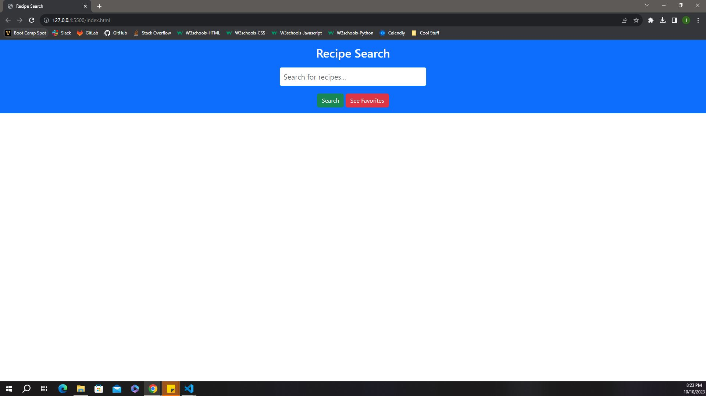

# Project1: Interactive Front-End Application

## Description
 - We wanted to create a search that allows the user to search recipes by their ingredients and favorite their favorite results.

## Table of Contents

  - [Credits](#credits)
  - [Badges](#badges)
  - [Features](#features)
  - [Photo](#Photo)
  - [DeploymentLink](#Deployment-Link)

## Credits
 - This website was coded by Katoria, Brandon Clark, and Joseph Dakota Johnson.
 - Instructor Caleb Crum helped us during class by showing us ways we can work on the APIs, saving to local storage through the 'Favorite' button, and providing an error response when YouTube's API calls have met their quota. [Caleb's GitHub account](https://github.com/CalebCrumInstructor)
 - Katoria worked on saving to local storage and the favorite button.
 - Clark worked on styling through Bootstrap and CSS, cleaning up the code, and figuring out the JavaScript.
 - Dakota worked on the Edamam API, the YouTube API, and making the video an external link.

## Badges
 - 
 - 
 - 
 - 
 - 
 - 
 - 

## Features
 - When the user types in a name of an ingredient and clicks the 'Search' button, they will be presented with an array of recipes that can be made with that ingredient and the additional ingredients necessary for the recipes.
 - Then, the user may click the 'Favorite' button on any of the recipes to save them to local storage.
 - If the user wants to see how the recipe is made, he or she may click the video to be redirected to a YouTube tutorial video.
 - If the user clicks the 'See Favorites' button, he or she will be redirected to another page that shows their previously favorited recipes.
 - Then, the user may click the 'Go To Search' button to return back to the homepage.

## Photo
 - This is a screenshot of the application: .

## Deployment Link
 - This is a link to the fully deployed application: (https://clarky13f.github.io/Project1/).
 - This is a link to the repository: (https://github.com/Clarky13F/Project1).